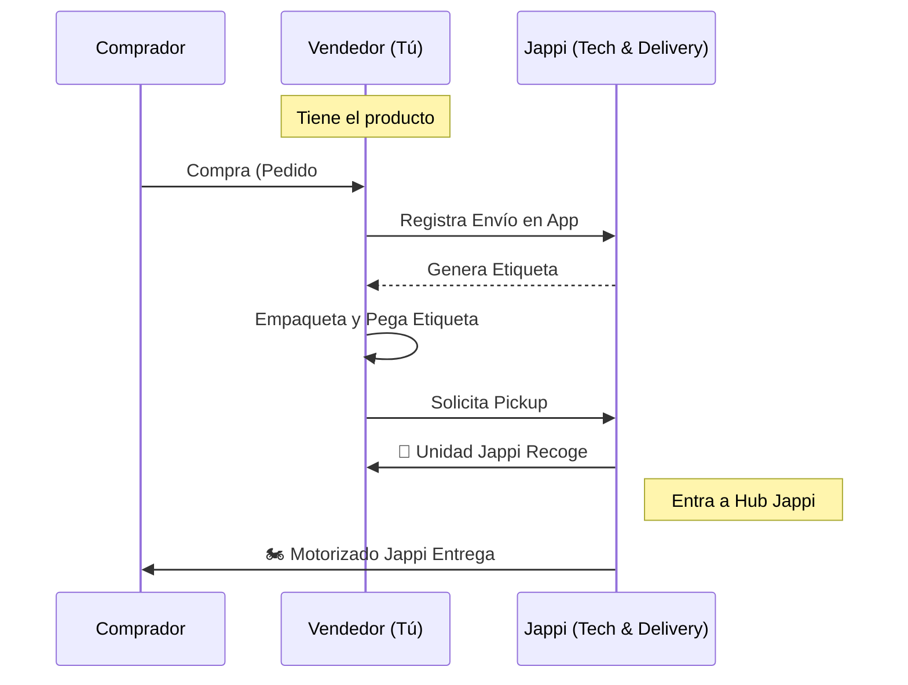
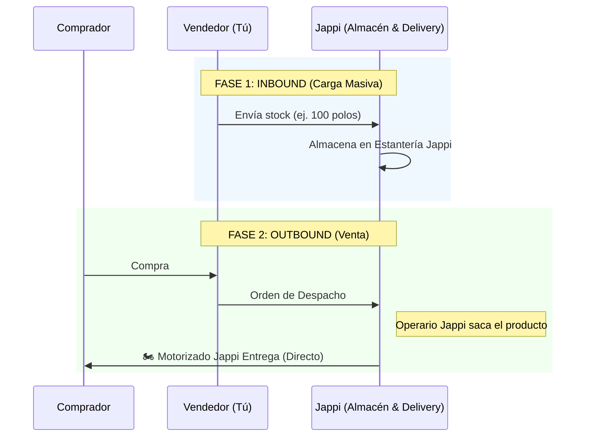

# Flujos Logísticos Jappi (Plataforma + Operador)

Jappi controla toda la experiencia: tecnología y logística física.

## 1. Merchant Fulfillment ("Con recojo a domicilio")
Jappi va a tu puerta a recoger los paquetes ya vendidos.

## 2. Fulfillment Center ("Desde Almacén Japi")
Tu stock ya vive en Jappi. Despacho inmediato sin que muevas un dedo.

## Diferencias Clave

| Característica | Merchant Fulfillment | Fulfillment Japi |
| :--- | :--- | :--- |
| **¿Dónde está el stock?** | En tu local/casa | En el almacén de Japi |
| **¿Quién empaqueta?** | Tú (Vendedor) | Japi (Operarios) |
| **Momento del Recojo** | **Diario**, por cada venta generada | **Esporádico**, solo para reabastecer stock masivo |
| **Velocidad de Despacho** | Depende de tu rapidez para empaquetar | Inmediata (Same Day/Next Day) |
| **Costo Operativo** | Tu tiempo + Materiales de empaque | Tarifa de almacenamiento + Picking/Packing |
