# Flujos Logísticos Jappi (Plataforma + Operador)

Jappi controla toda la experiencia: tecnología y logística física.

## 1. Merchant Fulfillment ("Con recojo a domicilio")
Jappi va a tu puerta a recoger los paquetes ya vendidos.

```mermaid
sequenceDiagram
    participant C as Comprador
    participant V as Vendedor (Tú)
    participant J as Jappi (Tech & Delivery)
    
    Note over V: Tiene el producto
    C->>V: Compra (Pedido #123)
    V->>J: Registra Envío en App
    J-->>V: Genera Etiqueta
    V->>V: Empaqueta y Pega Etiqueta
    V->>J: Solicita Pickup
    J->>V: 🚚 Unidad Jappi Recoge
    Note right of J: Entra a Hub Jappi
    J->>C: 🏍️ Motorizado Jappi Entrega
```

## 2. Fulfillment Center ("Desde Almacén Japi")
Tu stock ya vive en Jappi. Despacho inmediato sin que muevas un dedo.

```mermaid
sequenceDiagram
    participant C as Comprador
    participant V as Vendedor (Tú)
    participant J as Jappi (Almacén & Delivery)
    
    %% FASE 1: REABASTECIMIENTO
    rect rgb(240, 248, 255)
        Note over V, J: FASE 1: INBOUND (Carga Masiva)
        V->>J: Envía stock (ej. 100 polos)
        J->>J: Almacena en Estantería Jappi
    end

    %% FASE 2: VENTA
    rect rgb(240, 255, 240)
        Note over V, J: FASE 2: OUTBOUND (Venta)
        C->>V: Compra
        V->>J: Orden de Despacho
        Note right of J: Operario Jappi saca el producto
        J->>C: 🏍️ Motorizado Jappi Entrega (Directo)
    end
```

## Diferencias Clave

| Característica | Merchant Fulfillment | Fulfillment Japi |
| :--- | :--- | :--- |
| **¿Dónde está el stock?** | En tu local/casa | En el almacén de Japi |
| **¿Quién empaqueta?** | Tú (Vendedor) | Japi (Operarios) |
| **Momento del Recojo** | **Diario**, por cada venta generada | **Esporádico**, solo para reabastecer stock masivo |
| **Velocidad de Despacho** | Depende de tu rapidez para empaquetar | Inmediata (Same Day/Next Day) |
| **Costo Operativo** | Tu tiempo + Materiales de empaque | Tarifa de almacenamiento + Picking/Packing |
